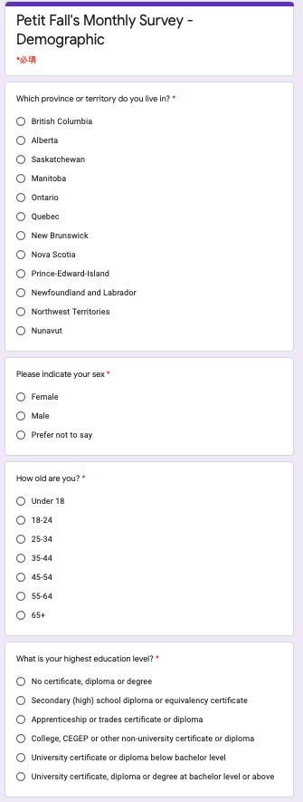

```{r setup, include=FALSE}
knitr::opts_chunk$set(echo = TRUE)
library(readxl)
library(dplyr)
library(knitr)
library(ggplot2)
```

```{r, include=FALSE, message=FALSE, warning=FALSE}
election_data <- read_excel("election_data.xlsx")
```


```{r satisfaction, include=FALSE, message=FALSE, warning=FALSE, }
election_data$`How's your satisfaction with the current Canadian government?` <-
  factor(election_data$`How's your satisfaction with the current Canadian government?`,
         levels = c("Very Dissatisfied", "Somewhat Dissatisfied", "Somewhat Satisfied", 
                    "Very Satisfied", "No Opinion"))

sat <- election_data %>% group_by(`How's your satisfaction with the current Canadian government?`) %>% count()
sat$pct <- sat$n/2000
sat %>% ggplot(aes(x = sat$`How's your satisfaction with the current Canadian government?`, y = sat$pct, label = scales::percent(pct), fill =`How's your satisfaction with the current Canadian government?` )) +
  geom_bar(stat = "identity") +
  xlab("Satisfaction") +
  ylab("Percentage of Satisfaction") +
  labs(
    title = "Satisfaction with the Current Government"
  ) + 
  theme_minimal()+ 
  theme(axis.text.x = element_blank()) +
  scale_y_continuous(labels=scales::percent) +
  geom_text(position = position_dodge(width = .9), hjust = 0.5, vjust = -0.5, size = 3) +
  scale_fill_grey(name = "satisfaction")
```


```{r Alignment, include=FALSE, message=FALSE, warning=FALSE}
# Alignment between people and the government
mean_alignment <- mean(election_data$`How much do you value the alignment between you and the candidate's policies?`)
alignment <- election_data %>% group_by(`How much do you value the alignment between you and the candidate's policies?`) %>% count()
alignment$pct <- alignment$n/2000
alignment%>% ggplot(aes(x = factor(alignment$`How much do you value the alignment between you and the candidate's policies?`), y = alignment$pct, label = scales::percent(pct))) +
  geom_bar(stat = "identity") +
  geom_text(position = position_dodge(width = .9), vjust = -1, size = 3)+
  xlab("Ratings") +
  scale_y_continuous(labels=scales::percent) +
  labs(title = "Ideology Alignment") +
  ylab("Percentage of Each Rating")
```

```{r, include=FALSE, message=FALSE, warning=FALSE}
# Covid
mean_covid <- mean(election_data$`How would you rate the current government's response on combating COVID-19?`)
covid_prov <- as.data.frame(cbind(election_data$`How would you rate the current government's response on combating COVID-19?`, election_data$`Which province or territory do you live in?`))
covid_prov$V1 <- as.integer(covid_prov$V1)
covid_mean <- as.data.frame(aggregate(covid_prov$V1, list(covid_prov$V2), mean))
covid_sd <- as.data.frame(aggregate(covid_prov$V1, list(covid_prov$V2), sd))
covid_sd[8, 2] <- 0
covid_sd[13, 2] <- 0
demo_count <- election_data %>% group_by(`Which province or territory do you live in?`) %>% count()
info <- as.data.frame(cbind(demo_count, covid_mean$x, covid_sd$x))
N_n <- c(4067175, 4648055, 1278365, 747101, 519716, 41786, 923598, 35944, 13448494, 142907, 8164361, 1098352, 35874)
weight <- N_n/35151728
info <- cbind(info, N_n, prov_ratio)
colnames(info) <- c("Which province or territory do you live in?", "n","Mean", "Standard Deviation", "Province_population", "Weight")

mu <- sum(info$Weight*info$Mean)
sd <- sum(info$Weight^2*(1-info$n/info$Province_population)*info$`Standard Deviation`^2/info$n)
up_interval <- mu+sd
lower_interval <- mu-sd
stats <- as.data.frame(cbind(mu, sd, up_interval, lower_interval))
colnames(stats) <- c("Mean", "Standard Deviation", "5%", "95%")
```


```{r, include=FALSE, message=FALSE, warning=FALSE}
covid <- election_data %>% group_by(`How would you rate the current government's response on combating COVID-19?`) %>% count()
covid$pct <- covid$n/2000
covid%>% ggplot(aes(x = factor(covid$`How would you rate the current government's response on combating COVID-19?`), y = covid$pct, label = scales::percent(pct))) +
  geom_bar(stat = "identity") +
  geom_text(position = position_dodge(width = .9), vjust = -1, size = 3)+
  xlab("Ratings") +
  scale_y_continuous(labels=scales::percent) +
  labs(title = "Rating for Government's Response on COVID-19") +
  ylab("Percentage of Each Rating") +
  theme_minimal()
```


```{r, include=FALSE, message=FALSE, warning=FALSE}
# Important Issues in Canada

issues <- election_data %>% group_by(`In your opinion, what is the most important issue facing in Canada today?`) %>% count()
issues$pct <- issues$n/2000

issues %>% ggplot(aes(x = issues$`In your opinion, what is the most important issue facing in Canada today?`, y = issues$pct, label = scales::percent(pct), fill =`In your opinion, what is the most important issue facing in Canada today?`)) +
  geom_bar(stat = "identity") +
  xlab(" ") +
  ylab("Percentage For Each Issue") +
  labs(
    title = "Issue Facing in Canada Today"
  ) + 
  theme_minimal()+ 
  theme(axis.text.x = element_blank()) +
  scale_y_continuous(labels=scales::percent) +
  geom_text(position = position_dodge(width = .9), hjust = 0.5, vjust = 0, size = 3) +
  scale_fill_grey(name = "Issues")
```


```{r include=FALSE, message=FALSE, warning=FALSE}
# Voting Intention Graph in Canada
intention <- election_data %>% group_by(`If the Federal Election were being held today, who would you vote for?`) %>% count()
intention$pct <- intention$n/2000

intention %>% ggplot(aes(x = intention$`If the Federal Election were being held today, who would you vote for?`, y = intention$pct, label = scales::percent(pct), fill =`If the Federal Election were being held today, who would you vote for?`)) +
  geom_bar(stat = "identity") +
  xlab(" ") +
  ylab("Voting Intentions") +
  labs(
    title = "Voting Intentions For Leaders/Parties"
  ) + 
  theme_minimal()+ 
  theme(axis.text.x = element_blank()) +
  scale_y_continuous(labels=scales::percent) +
  geom_text(position = position_dodge(width = .9), hjust = 0.5, vjust = -0.5, size = 3) +
  scale_fill_grey(name = "Leaders/Parties")
```


```{r include=FALSE, message=FALSE, warning=FALSE}
# calculate the percentage of each supporters


age_cad <- as.data.frame(cbind(election_data$`How old are you?`, election_data$`If the Federal Election were being held today, who would you vote for?`, election_data$`Which province or territory do you live in?`))

n <- 2000
total <- sum(age_cad$V2 =="Erin O’Toole's Conservative Party of Canada")/2000*100
can_1 <- subset(age_cad, V2 == "Erin O’Toole's Conservative Party of Canada")
per_18_24 <- sum(can_1$V1 == "18-24")/sum(age_cad$V1 == "18-24")*100
per_25_34 <- sum(can_1$V1 == "25-34")/sum(age_cad$V1 == "25-34")*100
per_35_44 <- sum(can_1$V1 == "35-44")/sum(age_cad$V1 == "35-44")*100
per_45_54 <- sum(can_1$V1 == "45-54")/sum(age_cad$V1 == "45-54")*100
per_55_64 <- sum(can_1$V1 == "55-64")/sum(age_cad$V1 == "55-64")*100
per_65p <- sum(can_1$V1 == "65+")/sum(age_cad$V1 == "65+")*100
per_on <- sum(can_1$V3 == "Ontario")/sum(age_cad$V3 == "Ontario")*100
per_bc <- sum(can_1$V3 == "British Columbia")/sum(age_cad$V3 == "British Columbia")*100
per_quebec <- sum(can_1$V3 == "Quebec")/sum(age_cad$V3 == "Quebec")*100
per_alberta <- sum(can_1$V3 == "Alberta")/sum(age_cad$V3 == "Alberta")*100
per_other <- sum(can_1$V3 == "Saskatchewan", can_1$V3 == "Manitoba", can_1$V3 == "New Brunswick", can_1$V3 == "Nova Scotia", can_1$V3 =="Newfoundland and Labrador", can_1$V3 == "Prince-Edward-Island", can_1$V3 == "Northwest Territories", can_1$V3 == "Nunavut")/sum(age_cad$V3 == "Saskatchewan", age_cad$V3 == "Manitoba", age_cad$V3 == "New Brunswick", age_cad$V3 == "Nova Scotia", age_cad$V3 =="Newfoundland and Labrador", age_cad$V3 == "Prince-Edward-Island", age_cad$V3 == "Northwest Territories", age_cad$V3 == "Nunavut", age_cad$V3 == "Yukon")*100
con_party <- as.data.frame(cbind(per_18_24, per_25_34, per_35_44, per_45_54, per_55_64, per_65p, per_on, per_bc, per_alberta, per_quebec, per_other, total))


total <- sum(age_cad$V2 =="Justin Trudeau's Liberal Party of Canada")/2000*100
can_1 <- subset(age_cad, V2 == "Justin Trudeau's Liberal Party of Canada")
per_18_24 <- sum(can_1$V1 == "18-24")/sum(age_cad$V1 == "18-24")*100
per_25_34 <- sum(can_1$V1 == "25-34")/sum(age_cad$V1 == "25-34")*100
per_35_44 <- sum(can_1$V1 == "35-44")/sum(age_cad$V1 == "35-44")*100
per_45_54 <- sum(can_1$V1 == "45-54")/sum(age_cad$V1 == "45-54")*100
per_55_64 <- sum(can_1$V1 == "55-64")/sum(age_cad$V1 == "55-64")*100
per_65p <- sum(can_1$V1 == "65+")/sum(age_cad$V1 == "65+")*100
per_on <- sum(can_1$V3 == "Ontario")/sum(age_cad$V3 == "Ontario")*100
per_bc <- sum(can_1$V3 == "British Columbia")/sum(age_cad$V3 == "British Columbia")*100
per_quebec <- sum(can_1$V3 == "Quebec")/sum(age_cad$V3 == "Quebec")*100
per_alberta <- sum(can_1$V3 == "Alberta")/sum(age_cad$V3 == "Alberta")*100
per_other <- sum(can_1$V3 == "Saskatchewan", can_1$V3 == "Manitoba", can_1$V3 == "New Brunswick", can_1$V3 == "Nova Scotia", can_1$V3 =="Newfoundland and Labrador", can_1$V3 == "Prince-Edward-Island", can_1$V3 == "Northwest Territories", can_1$V3 == "Nunavut")/sum(age_cad$V3 == "Saskatchewan", age_cad$V3 == "Manitoba", age_cad$V3 == "New Brunswick", age_cad$V3 == "Nova Scotia", age_cad$V3 =="Newfoundland and Labrador", age_cad$V3 == "Prince-Edward-Island", age_cad$V3 == "Northwest Territories", age_cad$V3 == "Nunavut", age_cad$V3 == "Yukon")*100
lib_party <- as.data.frame(cbind(per_18_24, per_25_34, per_35_44, per_45_54, per_55_64, per_65p, per_on, per_bc, per_alberta, per_quebec, per_other, total))

total <- sum(age_cad$V2 =="Jagmeet Singh's New Democratic Party of Canada")/2000*100
can_1 <- subset(age_cad, V2 == "Jagmeet Singh's New Democratic Party of Canada")
per_18_24 <- sum(can_1$V1 == "18-24")/sum(age_cad$V1 == "18-24")*100
per_25_34 <- sum(can_1$V1 == "25-34")/sum(age_cad$V1 == "25-34")*100
per_35_44 <- sum(can_1$V1 == "35-44")/sum(age_cad$V1 == "35-44")*100
per_45_54 <- sum(can_1$V1 == "45-54")/sum(age_cad$V1 == "45-54")*100
per_55_64 <- sum(can_1$V1 == "55-64")/sum(age_cad$V1 == "55-64")*100
per_65p <- sum(can_1$V1 == "65+")/sum(age_cad$V1 == "65+")*100
per_on <- sum(can_1$V3 == "Ontario")/sum(age_cad$V3 == "Ontario")*100
per_bc <- sum(can_1$V3 == "British Columbia")/sum(age_cad$V3 == "British Columbia")*100
per_quebec <- sum(can_1$V3 == "Quebec")/sum(age_cad$V3 == "Quebec")*100
per_alberta <- sum(can_1$V3 == "Alberta")/sum(age_cad$V3 == "Alberta")*100
per_other <- sum(can_1$V3 == "Saskatchewan", can_1$V3 == "Manitoba", can_1$V3 == "New Brunswick", can_1$V3 == "Nova Scotia", can_1$V3 =="Newfoundland and Labrador", can_1$V3 == "Prince-Edward-Island", can_1$V3 == "Northwest Territories", can_1$V3 == "Nunavut")/sum(age_cad$V3 == "Saskatchewan", age_cad$V3 == "Manitoba", age_cad$V3 == "New Brunswick", age_cad$V3 == "Nova Scotia", age_cad$V3 =="Newfoundland and Labrador", age_cad$V3 == "Prince-Edward-Island", age_cad$V3 == "Northwest Territories", age_cad$V3 == "Nunavut", age_cad$V3 == "Yukon")*100
new_do <- as.data.frame(cbind(per_18_24, per_25_34, per_35_44, per_45_54, per_55_64, per_65p, per_on, per_bc, per_alberta, per_quebec, per_other, total))

total <- sum(age_cad$V2 == "Yves-Francois Blanchet's Bloc Québécois")/2000*100
can_1 <- subset(age_cad, V2 == "Yves-Francois Blanchet's Bloc Québécois")
per_18_24 <- sum(can_1$V1 == "18-24")/sum(age_cad$V1 == "18-24")*100
per_25_34 <- sum(can_1$V1 == "25-34")/sum(age_cad$V1 == "25-34")*100
per_35_44 <- sum(can_1$V1 == "35-44")/sum(age_cad$V1 == "35-44")*100
per_45_54 <- sum(can_1$V1 == "45-54")/sum(age_cad$V1 == "45-54")*100
per_55_64 <- sum(can_1$V1 == "55-64")/sum(age_cad$V1 == "55-64")*100
per_65p <- sum(can_1$V1 == "65+")/sum(age_cad$V1 == "65+")*100
per_on <- sum(can_1$V3 == "Ontario")/sum(age_cad$V3 == "Ontario")*100
per_bc <- sum(can_1$V3 == "British Columbia")/sum(age_cad$V3 == "British Columbia")*100
per_quebec <- sum(can_1$V3 == "Quebec")/sum(age_cad$V3 == "Quebec")*100
per_alberta <- sum(can_1$V3 == "Alberta")/sum(age_cad$V3 == "Alberta")*100
per_other <- sum(can_1$V3 == "Saskatchewan", can_1$V3 == "Manitoba", can_1$V3 == "New Brunswick", can_1$V3 == "Nova Scotia", can_1$V3 =="Newfoundland and Labrador", can_1$V3 == "Prince-Edward-Island", can_1$V3 == "Northwest Territories", can_1$V3 == "Nunavut")/sum(age_cad$V3 == "Saskatchewan", age_cad$V3 == "Manitoba", age_cad$V3 == "New Brunswick", age_cad$V3 == "Nova Scotia", age_cad$V3 =="Newfoundland and Labrador", age_cad$V3 == "Prince-Edward-Island", age_cad$V3 == "Northwest Territories", age_cad$V3 == "Nunavut", age_cad$V3 == "Yukon")*100
bloc_q <- as.data.frame(cbind(per_18_24, per_25_34, per_35_44, per_45_54, per_55_64, per_65p, per_on, per_bc, per_alberta, per_quebec, per_other, total))

total <- sum(age_cad$V2 == "Annamie Paul's Green Party of Canada")/2000*100
can_1 <- subset(age_cad, V2 == "Annamie Paul's Green Party of Canada")
per_18_24 <- sum(can_1$V1 == "18-24")/sum(age_cad$V1 == "18-24")*100
per_25_34 <- sum(can_1$V1 == "25-34")/sum(age_cad$V1 == "25-34")*100
per_35_44 <- sum(can_1$V1 == "35-44")/sum(age_cad$V1 == "35-44")*100
per_45_54 <- sum(can_1$V1 == "45-54")/sum(age_cad$V1 == "45-54")*100
per_55_64 <- sum(can_1$V1 == "55-64")/sum(age_cad$V1 == "55-64")*100
per_65p <- sum(can_1$V1 == "65+")/sum(age_cad$V1 == "65+")*100
per_on <- sum(can_1$V3 == "Ontario")/sum(age_cad$V3 == "Ontario")*100
per_bc <- sum(can_1$V3 == "British Columbia")/sum(age_cad$V3 == "British Columbia")*100
per_quebec <- sum(can_1$V3 == "Quebec")/sum(age_cad$V3 == "Quebec")*100
per_alberta <- sum(can_1$V3 == "Alberta")/sum(age_cad$V3 == "Alberta")*100
per_other <- sum(can_1$V3 == "Saskatchewan", can_1$V3 == "Manitoba", can_1$V3 == "New Brunswick", can_1$V3 == "Nova Scotia", can_1$V3 =="Newfoundland and Labrador", can_1$V3 == "Prince-Edward-Island", can_1$V3 == "Northwest Territories", can_1$V3 == "Nunavut")/sum(age_cad$V3 == "Saskatchewan", age_cad$V3 == "Manitoba", age_cad$V3 == "New Brunswick", age_cad$V3 == "Nova Scotia", age_cad$V3 =="Newfoundland and Labrador", age_cad$V3 == "Prince-Edward-Island", age_cad$V3 == "Northwest Territories", age_cad$V3 == "Nunavut", age_cad$V3 == "Yukon")*100
green_party <- as.data.frame(cbind(per_18_24, per_25_34, per_35_44, per_45_54, per_55_64, per_65p, per_on, per_bc, per_alberta, per_quebec, per_other, total))

total <- sum(age_cad$V2 =="Others")/2000*100
can_1 <- subset(age_cad, V2 == "Others")
per_18_24 <- sum(can_1$V1 == "18-24")/sum(age_cad$V1 == "18-24")*100
per_25_34 <- sum(can_1$V1 == "25-34")/sum(age_cad$V1 == "25-34")*100
per_35_44 <- sum(can_1$V1 == "35-44")/sum(age_cad$V1 == "35-44")*100
per_45_54 <- sum(can_1$V1 == "45-54")/sum(age_cad$V1 == "45-54")*100
per_55_64 <- sum(can_1$V1 == "55-64")/sum(age_cad$V1 == "55-64")*100
per_65p <- sum(can_1$V1 == "65+")/sum(age_cad$V1 == "65+")*100
per_on <- sum(can_1$V3 == "Ontario")/sum(age_cad$V3 == "Ontario")*100
per_bc <- sum(can_1$V3 == "British Columbia")/sum(age_cad$V3 == "British Columbia")*100
per_quebec <- sum(can_1$V3 == "Quebec")/sum(age_cad$V3 == "Quebec")*100
per_alberta <- sum(can_1$V3 == "Alberta")/sum(age_cad$V3 == "Alberta")*100
per_other <- sum(can_1$V3 == "Saskatchewan", can_1$V3 == "Manitoba", can_1$V3 == "New Brunswick", can_1$V3 == "Nova Scotia", can_1$V3 =="Newfoundland and Labrador", can_1$V3 == "Prince-Edward-Island", can_1$V3 == "Northwest Territories", can_1$V3 == "Nunavut")/sum(age_cad$V3 == "Saskatchewan", age_cad$V3 == "Manitoba", age_cad$V3 == "New Brunswick", age_cad$V3 == "Nova Scotia", age_cad$V3 =="Newfoundland and Labrador", age_cad$V3 == "Prince-Edward-Island", age_cad$V3 == "Northwest Territories", age_cad$V3 == "Nunavut", age_cad$V3 == "Yukon")*100
other <- as.data.frame(cbind(per_18_24, per_25_34, per_35_44, per_45_54, per_55_64, per_65p, per_on, per_bc, per_alberta, per_quebec, per_other, total))

potential_voters <- as.data.frame(rbind(lib_party, con_party, new_do, bloc_q, green_party, other))
colnames(potential_voters) <- c("18-24", "25-34", "35-44", "45_54", "55-64", "65+", "Ontario", "British Columbia", "Alberta", "Quebec", "Other", "Total")
rownames(potential_voters) <- c("Justin Trudeau/Liberal", "Erin O’Toole/Conservative",  "Jagmeet Singh/New Democratic", "Bloc Québécois/Yves-Francois Blanchet","Annamie Paul/Green Party", "Others")

```

To access the R Markdown file please check this GitHub Repo: 

# Non-Technical Executive Summary

Petit Poll has been hired by the Liberal Party to conduct the 2020 October Monthly Polling updates on approval rating and public opinions of the current government. Future federal elections could reference the results of this survey and analysis. In our survey methodology, each province has been assigned a sample number according to its ratio to Canada's population. The samples would be interviewed by phone. Due to the COVID-19 pandemic situation right now, the ideology they had during the 2019 Federal Election would ultimately be different. Thus, it is essential to understand people's thoughts under the current situation. After simulating the data, we found that people are generally satisfied with how the government responded to the COVID-19 situation. However, this pandemic also creates issues that people are starting to notice: the economy and health care. In general, people are satisfied with the government leads by the Liberal Party and Prime Minister Justin Trudeau, in which 36.8% of the respondents are willing to vote for him if the election is held today. Despite these simulated results positively showing the government's performance, our survey under-sampled people who support Bloc Quebecois in Quebec, which leads to the Liberal Party having a higher rating in Quebec. Since this survey identified the satisfaction and the issues that Canada faces, we should dive into the issue and see how the government can help. With the government's action, we can conduct the survey and see people's reactions to the actions. From modifying the policies and surveying continuously, the party can quickly know how to move forward with Canada.

# Introduction

This report is a simulated monthly polling update conducted by Petit Poll for the Liberal Party of Canada during the COVID-19 Pandemic in 2020. Generally, the Liberal Party of Canada, led by Justin Trudeau, has a 5.9% lead compared to the Conservative Party led by Erin O'Toole. With the effects of COVID-19, job markets and health care systems start to play a significant role in Canada's issue. This report will discuss the survey methodology implemented and the results that we obtained after analyzing the survey in detail.

# Survey Methodology

In this section, we will talk about the survey methodology used in our polling procedure. Since it is polling regarding the Federal Election, the **population** would be all the Canadian Citizens eligible to vote (people who are older and including 18 could vote in Canada). The **sampling frame** would be the telephone directory. According to Canadian Ratio-Television and Telecommunications Commission, 99.3% of the household had subscribed to either Landline phone service or Mobile Service (Government of Canada, 2019). Thus, with the area code's help in different provinces, for instance, the Ontario area code is 647, 437, 249, etc. (Canada Area Code) and random digit dialing, we can successfully conduct Stratified Sampling and Simple Random Sample Without Replacement in each stratum. Since the proportion among the provinces is different, we used *the proportional allocation* method to decide how many samples we should obtain in each province, which sets the stratum sample size $n_h$ proportional to the stratum population size $N_h$. The formula is the following $n_h = \frac{n}{N}N_h = nW_h$.

However, since we need to create an unbiased survey and conduct a phone interview for our samples, this method's cost is exceptionally time-consuming and labor-intensive. Before actually collecting the data, we need to randomly generate the phone numbers and make sure that the numbers work. Despite the time-consuming factor in the process, we believe that using random phone dialing would be a better option than Internet Surveys. It is comparatively easy to be biased for internet surveys since different provinces could have different political stances, which we cannot distinguish through internet surveys.

Since we are randomly generating the phone numbers, if there is a non-response sample, we would generate another phone number to survey. This will only be limited to non-response situations if the person conducting the survey decides not to record the response. Also, there would not be any privacy concerns in this situation because the survey does not ask samples' regarding their personal information.

# Results

This report is a simulated monthly polling update conducted by Petit Poll for the Liberal Party of Canada during the COVID-19 Pandemic in 2020. Generally, the Liberal Party of Canada, led by Justin Trudeau, has a 5.9% lead compared to the Conservative Party led by Erin O'Toole. With the effects of COVID-19, job markets and health care systems start to play a significant role in Canada's issue. This report will discuss the survey methodology implemented and the results that we obtained after analyzing the survey in detail.

## Question: How is your satisfaction with the current Canadian government? (Figure 1)

During the Pandemic, the Liberal Party is ahead of other contenders in Canada's political environment. We can see that in Figure 1 below. 46.4% of the people we surveyed rated that they are somewhat satisfied with the current government and what they are doing. On the other hand, there are 14.05% of the people dissatisfied with the government.

```{r}
sat %>% ggplot(aes(x = sat$`How's your satisfaction with the current Canadian government?`, y = sat$pct, label = scales::percent(pct), fill =`How's your satisfaction with the current Canadian government?` )) +
  geom_bar(stat = "identity") +
  xlab("Satisfaction") +
  ylab("Percentage of Satisfaction") +
  labs(
    title = "Satisfaction with the Current Government"
  ) + 
  theme_minimal()+ 
  theme(axis.text.x = element_blank()) +
  scale_y_continuous(labels=scales::percent) +
  geom_text(position = position_dodge(width = .9), hjust = 0.5, vjust = -0.5, size = 3) +
  scale_fill_grey(name = "satisfaction")
```

## Question: How much do you value the alignment between you and the candidate's policies? (Figure 2)

From rating 1 to 10, the average rating for how people value their ideology alignment with the government is 8.87. The highest portion at rating 9 (37.95%) means that people value governments' policies and ideology highly rather than being partisan of the parties.

```{r}
alignment%>% ggplot(aes(x = factor(alignment$`How much do you value the alignment between you and the candidate's policies?`), y = alignment$pct, label = scales::percent(pct))) +
  geom_bar(stat = "identity") +
  geom_text(position = position_dodge(width = .9), vjust = -1, size = 3)+
  xlab("Ratings") +
  scale_y_continuous(labels=scales::percent) +
  labs(title = "Ideology Alignment") +
  ylab("Percentage of Each Rating")
```

## Question: How would you rate the current government's response on combating COVID-19? (Figure 3)

```{r}
covid%>% ggplot(aes(x = factor(covid$`How would you rate the current government's response on combating COVID-19?`), y = covid$pct, label = scales::percent(pct))) +
  geom_bar(stat = "identity") +
  geom_text(position = position_dodge(width = .9), vjust = -1, size = 3)+
  xlab("Ratings") +
  scale_y_continuous(labels=scales::percent) +
  labs(title = "Rating for Government's Response on COVID-19") +
  ylab("Percentage of Each Rating") +
  theme_minimal()
```


As this survey is conducted during the COVID-19 pandemic, we want to know how Canadian citizens think about the government's performance. Generally, without considering each province, from rating 1 to 10, the mean is 7.029. However, since we conducted Stratified Random Sampling Without Replacement, we can apply the weight in each stratum to estimate the overall population mean, with the following formula: $\bar{y}{st} = \sum^H_{h = 1}W_h\bar{y}_h$. The result would be an unbiased estimator for the population mean. For the variance, we can obtain it by $v(\bar{y}_{st}) = \sum^H_{h = 1}W_h^2(1-\frac{n_h}{N_h})\frac{s^2_{yh}}{n_h}$. With this information, we can get an inference of the population. The population's average rating is 7.0382, with a standard deviation of 0.00157 (Table 1).

```{r}
kable(stats, caption = "Population Inference from Stratified Sample")
```

## Question: In your opinion, what is the most important issue facing in Canada today? (Figure 4)

```{r}
issues %>% ggplot(aes(x = issues$`In your opinion, what is the most important issue facing in Canada today?`, y = issues$pct, label = scales::percent(pct), fill =`In your opinion, what is the most important issue facing in Canada today?`)) +
  geom_bar(stat = "identity") +
  xlab(" ") +
  ylab("Percentage For Each Issue") +
  labs(
    title = "Issue Facing in Canada Today"
  ) + 
  theme_minimal()+ 
  theme(axis.text.x = element_blank()) +
  scale_y_continuous(labels=scales::percent) +
  geom_text(position = position_dodge(width = .9), hjust = 0.5, vjust = 0, size = 3) +
  scale_fill_grey(name = "Issues")
```

Here, we separate the issues into eight categories, Leadership, Crime, Energy, Environment, Foreign Affairs, Health Care, Housing, The Economy. Among all, concerns regarding the economy and health care have the first and second large percentages, 35.4% and 24.7%. Crime and Public safety come last among all the issues.

## Question: If the Federal Election were being held today, who would you vote for? (Table 2)

From the last question of the survey about the voting intentions with overall consideration of the situation now, we can separate into different categories to evaluate each leader's performance. The categories are the column names in the table, such as the ages and provinces. From a macro perspective, Justin Trudeau's Liberal Party receives an approval rating of 36.8%, which is 5.9% ahead of Erin O'Toole's Conservative Party (30.9%). Specifically, the voting intentions to vote for Justin Trudeau lead in the largest four provinces, Ontario, British Columbia, Alberta, and Quebec. Comparing to other provinces, the Liberal Party has the highest supporting percentage in British Columbia, with a difference of 14% ahead of the Conservative Party. For other provinces, the percentage of people who would vote for Justin Trudeau's Liberal Party is still higher than other leaders and parties. Interestingly, when we look at the distribution of the people who would vote for the Liberal Party in different ages, the age group 25-34 and 65+ stand out with the massive difference between the Liberal Party and the Conservative Party.

```{r}
kable(potential_voters, digits = 2, caption = "Voting Intentions (In Percentages)")
```


# Discussion

Regarding the 2020 October simulated polling result, it would be significantly affected by the government's response to the current COVID-19 situation. With the 46.6% of the surveyed people in the "Satisfied" category and the high rating on how the government responded to the situation for the past few months, we can say that the citizens are positively accepting what is coming from the Liberal Party and Justin Trudeau. Also, we can see it from his approval rating. Compared to his other direct competitor (Table 2), 36 .8% of the people would vote for him if the election is held today. Combining the chart of important issues and how people value their ideology with the government, we can know that the governing party should shift their focus to creating more jobs and securing a better health care system. Overall, the Liberal Party, led by Justin Trudeau, leads other parties and leaders in different categories, regardless of provinces or different age groups. 

# Weaknesses

Despite the positivities that the survey and the result given to the Liberal Party, there are still some weaknesses. With this survey methodology, two provinces only have one respondent, Nunavut, and Yukon (Table 3). Only one respondent's situation would make the survey too biased in these provinces since one person cannot represent the population entirely. One solution to this situation would be to survey more people regardless of the ratio from the telephone dialing process and the weight they respond afterward. Second of all, the measuring standards for different people are different. For instance, the satisfaction level and the rating problem would differ from person to person. However, with these questions, we can still acquire a certain standard of the answers. Lastly, since the data is simulated based on some present data, such as the 2016 census data, many situations would be hard to consider. For example, in Quebec, more people would vote for Bloc Quebecois (see Table 2 for reference). However, we simulated the data with the approval rating overall from the CBC polling website. It would be hard to control that Quebec should be more supporters for certain parties.

```{r}
kable(demo_count)
```


# Appendices

- Here is the link to the survey: [Survey](https://forms.gle/iyUZQNJTvKeDLMas8)

## Screenshots of the surveys



# Reference

## Report Refernce

- H. Wickham. ggplot2: Elegant Graphics for Data Analysis.
Springer-Verlag New York, 2016.
  
- R Core Team (2020). R: A language and environment for statistical
computing. R Foundation for Statistical Computing, Vienna, Austria.
URL https://www.R-project.org/.
  
- JJ Allaire and Yihui Xie and Jonathan McPherson and Javier Luraschi
and Kevin Ushey and Aron Atkins and Hadley Wickham and Joe Cheng
and Winston Chang and Richard Iannone (2020). rmarkdown: Dynamic
Documents for R. R package version 2.3. URL
https://rmarkdown.rstudio.com.

- Yihui Xie and J.J. Allaire and Garrett Grolemund (2018). R
Markdown: The Definitive Guide. Chapman and Hall/CRC. ISBN
9781138359338. URL https://bookdown.org/yihui/rmarkdown.

- Hadley Wickham and Jennifer Bryan (2019). readxl: Read Excel Files.
R package version 1.3.1. https://CRAN.R-project.org/package=readxl
  
- Hadley Wickham, Romain François, Lionel Henry and Kirill Müller
(2020). dplyr: A Grammar of Data Manipulation. R package version
1.0.2. https://CRAN.R-project.org/package=dplyr
  
- Yihui Xie (2020). knitr: A General-Purpose Package for Dynamic
Report Generation in R. R package version 1.29.

- Yihui Xie (2015) Dynamic Documents with R and knitr. 2nd edition.
Chapman and Hall/CRC. ISBN 978-1498716963

- Yihui Xie (2014) knitr: A Comprehensive Tool for Reproducible
Research in R. In Victoria Stodden, Friedrich Leisch and Roger D.
Peng, editors, Implementing Reproducible Computational Research.
Chapman and Hall/CRC. ISBN 978-1466561595
  
- Government of Canada, C. (2019, July 29). Communications Monitoring
Report 2018. Retrieved October 08, 2020, from
https://crtc.gc.ca/eng/publications/reports/policymonitoring/2018/cmr1.htm

- Canada Area Codes. (n.d.). Retrieved October 08, 2020, from https://www.allareacodes.com/canadian_area_codes.htm

- Wu, C., &amp; Thompson, M. E. (2020). Sampling Theory and Practice. Cham: Springer International Publishing.

- Population of Canada by province and territory. (2020, October 06). Retrieved October 08, 2020, from https://en.wikipedia.org/wiki/Population_of_Canada_by_province_and_territory

## Data Simulation Reference

- CBC News Canada Poll Tracker. (n.d.). Retrieved October 08, 2020, from https://newsinteractives.cbc.ca/elections/poll-tracker/canada/

- Population of Canada by province and territory. (2020, October 06). Retrieved October 08, 2020, from https://en.wikipedia.org/wiki/Population_of_Canada_by_province_and_territory

- S. (2016). Data tables, 2016 Census. Retrieved October 08, 2020, from https://www12.statcan.gc.ca/census-recensement/2016/dp-pd/dt-td/Rp-eng.cfm?TABID=2

- S. (2016). Education Highlight Tables, 2016 Census. Retrieved October 08, 2020, from https://www12.statcan.gc.ca/census-recensement/2016/dp-pd/hlt-fst/edu-sco/Table.cfm?Lang=E

